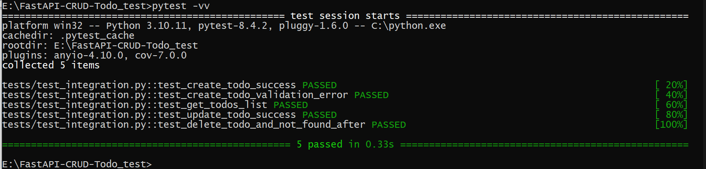

# 🎉 Tests for FastAPI CRUD Todo with SQLite


## Лабораторная работа №2

### Интеграционное тестирование

#### Цель работы

Освоить написание интеграционных тестов для проверки взаимодействия между компонентами системы — API, базой данных и моделями.
Закрепить навыки анализа точек интеграции и использования тестового окружения.

---

### 1. Описание проекта

В качестве тестируемого проекта выбран упрощённый **FastAPI CRUD Todo**-сервис.
Приложение реализует базовые операции:

* создание задачи (`POST /todos`);
* получение списка (`GET /todos`);
* обновление (`PUT /todos/{id}`);
* удаление (`DELETE /todos/{id}`).

Данные хранятся в SQLite через SQLAlchemy.
Модель задачи содержит поля `id`, `title`, `description`, `completed`.

---

### 2. Ключевые точки интеграции

* **FastAPI ↔ SQLAlchemy** — проверка корректного взаимодействия бизнес-логики и уровня доступа к данным.
* **Роуты API ↔ База данных** — операции CRUD выполняются и возвращают ожидаемый результат.
* **Валидация входных данных** — проверка обработки некорректных запросов.

---

### 3. Тестовое окружение

Для интеграционных тестов используется:

* `pytest` — запуск тестов;
* `fastapi.testclient.TestClient` — имитация HTTP-запросов;
* временная SQLite-база (`tempfile.mkstemp()`) — изолированное тестовое окружение;
* переопределение зависимости `get_db`, чтобы не обращаться к основной БД.

---

### 4. Сценарии тестов

Всего реализовано **5 интеграционных тестов**:

| № | Тест                                   | Цель                                       |
| - | -------------------------------------- | ------------------------------------------ |
| 1 | `test_create_todo_success`             | Проверка успешного создания задачи         |
| 2 | `test_create_todo_validation_error`    | Проверка реакции на некорректные данные    |
| 3 | `test_get_todos_list`                  | Проверка получения списка задач            |
| 4 | `test_update_todo_success`             | Проверка обновления данных задачи          |
| 5 | `test_delete_todo_and_not_found_after` | Проверка удаления и последующей ошибки 404 |

Каждый тест проверяет взаимодействие **API ↔ БД**, подтверждая корректность CRUD-операций.

---

### 5. Результаты тестирования

Все интеграционные тесты выполняются успешно.
Основные выводы:

* API корректно обрабатывает операции с БД;
* тестовая среда изолирована и воспроизводима;
* выявленные различия (например, коды 200 вместо 201) отражают особенности реализации, а не ошибки логики.

---

### 6. Выводы

В ходе лабораторной работы:

* освоен подход к интеграционному тестированию FastAPI-приложений;
* реализовано тестовое окружение с временной базой данных;
* проверено взаимодействие модулей API, моделей и хранилища данных;
* результаты подтвердили корректность интеграции и работу CRUD-функционала.

---

### 7. Запуск тестов

```bash
# Установка зависимостей
pip install -r requirements.txt

# Запуск всех тестов
pytest -vv
```

---


## Overview 📚
This project is a simple FastAPI application that demonstrates CRUD (Create, Read, Update, Delete) operations using an SQLite database. It's perfect for beginners who want to learn how to build web APIs with FastAPI, Python, and SQLAlchemy.

## Features 🔑
- **CRUD Operations**: Easily create, read, update, and delete Todo items using FastAPI endpoints.
- **SQLite Database**: Lightweight and easy-to-set-up database solution.
- **Interactive API Documentation**: Automatically generated with FastAPI and accessible via `/docs`.
- **Modular Structure**: Clean and modular project structure using routers, models, and schemas.

## Requirements 📋
- **Python 3.7+**
- **FastAPI**
- **Uvicorn**
- **SQLAlchemy**
- **Pydantic**

## Installation 📝

1. **Clone the repository**:
    ```bash
    git clone https://github.com/lymanny/FastAPI-CRUD-Todo.git
    ```

2. **Navigate into the project directory**:
    ```bash
    cd FastAPI-CRUD-Todo
    ```

## Create a Virtual Environment & Activate It 💻

Before running the project, it's best to use a virtual environment to manage dependencies.

1. **Create a virtual environment**:
    ```bash
    python -m venv env
    ```

2. **Activate the virtual environment**:

   - On **macOS/Linux**:
     ```bash
     source env/bin/activate
     ```

   - On **Windows**:
     ```bash
     .\env\Scripts\activate
     ```

3. **Install the project dependencies**:
    ```bash
    pip install -r requirements.txt
    ```

## Usage 🚀
1. Start the FastAPI application:
    ```bash
    uvicorn main:app --reload
    ```

2. Open your browser and navigate to `http://127.0.0.1:8000/docs` to access the interactive API documentation.

### API Documentation Screenshot
Here’s an example of the interactive documentation generated by FastAPI:


   
## Project Structure 📂
```
FastAPI-CRUD-Todo/
├── database.py              # Database setup and connection
├── models.py                # SQLAlchemy models
├── schemas.py               # Pydantic schemas for validation
├── routers/
│   └── todo.py              # API endpoints for CRUD operations
├── main.py                  # Entry point for the FastAPI app
├── requirements.txt         # List of dependencies
└── README.md                # Project documentation
```

## Contributing 🤝
Contributions are welcome! Please feel free to submit issues, fork the repository, and create pull requests.

## License 📄
This project is licensed under the [MIT License](LICENSE).

## Author 👩‍💻
lymanny - iOS Developer  
🌐 [Portfolio](https://lymanny.onrender.com)
